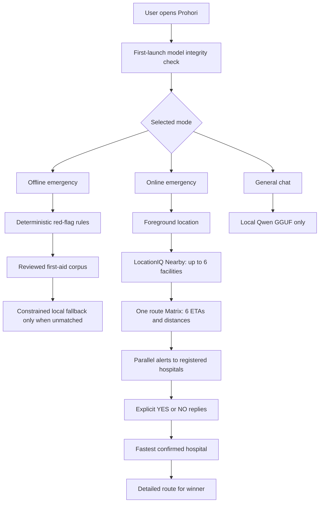

# Prohori

**Offline-first emergency guidance, nearby-hospital routing, and explicit hospital readiness confirmation for Android.**

[](https://github.com/Hasan3301-cyber/Prohori/actions/workflows/ci-public.yml)


> [!WARNING]
> Prohori is an emergency-support prototype, not a medical device and not a replacement for emergency services, a clinician, or verified local hospital information. The bundled city route is a demonstration and is visibly marked **not field checked**. Generated AI guidance is constrained and filtered, but has not completed clinical certification.

## Contents

- [The problem](#the-problem)
- [The solution](#the-solution)
- [Main features](#main-features)
- [How the system works](#how-the-system-works)
- [Download and install](#download-and-install)
- [User guide](#user-guide)
- [Hospital and Telegram setup](#hospital-and-telegram-setup)
- [Technology stack](#technology-stack)
- [Project structure](#project-structure)
- [Build from source](#build-from-source)
- [Testing](#testing)
- [Privacy and security](#privacy-and-security)
- [Known limitations](#known-limitations)

## The problem

During a medical emergency, especially after floods, cyclones, network outages, or road disruption, a person may face several problems at once:

- They may not know the correct first-aid action.
- Internet access may be slow or completely unavailable.
- The nearest hospital may not be able to accept the patient.
- Contacting hospitals one at a time wastes critical minutes.
- A geographically close hospital may take longer to reach because of road conditions.
- A message that receives no reply must not be interpreted as hospital acceptance.
- Cloud-only AI cannot help when the network is down and can expose sensitive information.

Most navigation applications can locate a hospital, but they do not prove that the hospital has explicitly agreed to receive the patient. Most chat applications can provide general text, but they do not combine deterministic emergency rules, offline first aid, route analysis, and auditable hospital confirmation.

## The solution

Prohori combines three independent capabilities in one Android application:

1. **Offline emergency guidance** using deterministic Rust safety rules and a reviewed first-aid corpus.
2. **Online multi-hospital coordination** using LocationIQ route data and parallel Telegram alerts to registered hospitals.
3. **Local general chat** using a Qwen3 1.7B Q4 GGUF model bundled inside the APK.

The emergency path does not depend on the AI model. Red-flag rules run first, and reviewed guidance remains available even when the model fails, the phone is offline, or the user skips first-launch model preparation.

## Main features

### Offline emergency mode

- Works without internet, an API key, or location permission.
- Detects critical phrases such as not breathing, severe bleeding, choking, stroke signs, seizures, burns, poisoning, and suspected fractures.
- Searches an embedded first-aid corpus with deterministic retrieval.
- Shows an emergency call action without placing a background call.
- Uses cited and versioned first-aid protocol files.
- Can generate additional local guidance when no reviewed template matches.
- Rejects generated output that violates medication, dosing, grounding, or emergency-escalation rules.
- Supports signed offline city packs and refuses invalid, incomplete, stale, blocked, or tampered route data.
- Displays previously cached online routes as stale and unconfirmed rather than presenting them as live information.

### Online emergency mode

- Requests the phone's foreground location only after user action.
- Uses LocationIQ Nearby to find real medical facilities.
- Filters pharmacies, laboratories, veterinary facilities, duplicates, unnamed places, and invalid coordinates.
- Shortlists up to six hospitals, clinics, or doctor facilities.
- Uses one LocationIQ Matrix request to calculate road distance and ETA for all shortlisted hospitals.
- Falls back to quota-paced individual Directions requests when Matrix is unavailable.
- Never silently drops a shortlisted hospital because another route request was rate-limited.
- Sends alerts concurrently to all registered hospital Telegram chats.
- Accepts only explicit `YES` or `NO` replies.
- Never treats silence, “maybe,” “ready,” or inferred availability as confirmation.
- Selects the confirmed hospital with the shortest provider ETA.
- Fetches detailed turn-by-turn directions only for the selected confirmed hospital.
- Opens the selected destination in an installed navigation application.

### General chat mode

- Runs entirely on the phone with the bundled GGUF model.
- Does not call LocationIQ, contact hospitals, or use hospital-routing tools.
- Clearly tells users to switch to Emergency mode when an emergency is described.
- Keeps a bounded recent conversation context.

### Bundled local AI

- Includes `Qwen3-1.7B-Q4_K_M.gguf` directly in the APK.
- Stores the model as an uncompressed APK asset.
- Copies it into private app storage on first launch because llama.cpp requires a regular file path.
- Checks the exact model size, GGUF header, and SHA-256 before enabling AI features.
- Preserves an already-installed valid model during application upgrades.
- Offers Retry or Continue without local AI if the phone lacks storage.

## How the system works



### Hospital selection rule

Prohori does not let an AI invent the winning hospital. Selection is deterministic:

1. The facility must have a valid registered contact.
2. The alert must have been delivered.
3. The hospital must explicitly reply `YES` for the matching case.
4. Among confirmed hospitals, the lowest provider ETA wins.
5. Facility ID is the stable tie-breaker.

## Download and install

### Ready-to-install APK

Download the bundled-model debug APK from the latest release:

**[Download Prohori APK](https://github.com/Hasan3301-cyber/Prohori/releases/download/v0.7.0-dev/prohori-v0.7.0-dev-debug.apk)**

> [!IMPORTANT]
> Install the signed debug APK above. Do **not** install
> `app-release-unsigned.apk`; Android can display its Prohori label but will reject that
> unsigned build as an invalid package.

Requirements:

- Android 7.0 or newer (`minSdk 24`)
- ARM64 Android phone
- Approximately 1.2 GB for the APK download
- At least 2.5–3 GB free during installation and first launch

Installation:

1. Download the APK to the phone.
2. Open it from Files or Downloads.
3. Allow **Install unknown apps** for that file manager when Android asks.
4. Install and open Prohori.
5. Keep the application open while **Preparing local AI** is displayed.
6. After the model is copied and verified, the three application modes appear.

ADB installation is often more reliable for a large APK:

```powershell
adb install --streaming -r -t prohori-v0.7.0-dev-debug.apk
```

The downloadable APK is debug-signed for evaluation. A production deployment must use an organization-controlled release signing key.

## User guide

### 1. Offline emergency guidance

1. Select **Offline** from the bottom navigation.
2. Type what is happening in plain language, for example:
   - `He is not breathing.`
   - `My father has chest pain and is sweating.`
   - `She burned her arm with hot water.`
3. Read the immediate emergency card and follow the emergency-call instruction when shown.
4. Review matching first-aid steps and the “do not” warnings.
5. If no reviewed guide matches, Prohori may show a separate block labelled as words written by the model on this phone.
6. Do not wait for AI output before calling emergency services when a red flag is present.

Offline routing is available through signed city packs. The bundled RUET-to-RMCH route is a technical demonstration, not verified navigation data.

### 2. Online nearby-hospital routing

1. Select **Online**.
2. Open **Settings**.
3. Add a LocationIQ API key.
4. Configure either a relay URL and device token, or a personal Telegram bot token.
5. Save the settings.
6. Press **Find nearby hospitals**.
7. Grant foreground location permission.
8. Review the returned candidates, road distance, and ETA.
9. Register a verified Telegram chat ID for each hospital and press **Save contact**.
10. Press **Notify all registered hospitals in parallel**.
11. Wait for explicit hospital replies.
12. When one or more hospitals reply `YES`, Prohori displays the fastest confirmed option.
13. Press **Open route** to launch navigation.

If the internet later disappears, Offline mode may show the last online route, but it labels its age and states that readiness and traffic are no longer current.

### 3. General chat

1. Select **Chat**.
2. Type a general question.
3. Press **Send**.
4. Wait for the local model response.

Chat mode cannot find, alert, confirm, or select a hospital. Use Online or Offline emergency mode for emergency actions.

## Hospital and Telegram setup

A Telegram bot cannot initiate a conversation with a hospital group that has never added it.

For every participating hospital:

1. Hospital staff create or choose a Telegram group.
2. Staff add the Prohori Telegram bot to the group or start the bot directly.
3. The operator obtains the numeric chat ID or verified `@username`.
4. The chat ID is registered against the exact facility returned by LocationIQ.
5. A supervised test alert is performed before emergency use.

For multiple phones, use an organization-hosted relay instead of sharing one bot token between devices. Telegram permits only one reliable `getUpdates` consumer for a bot. The relay acts as that single consumer and routes replies to the matching case.

| Setting | Purpose |
|---|---|
| LocationIQ API key | Nearby discovery, Matrix ETA, and detailed Directions |
| Relay HTTPS URL | Organization-hosted hospital alert relay |
| Relay device token | Authenticates the phone to the relay |
| Personal Telegram bot token | Single-device testing when no relay is available |
| Hospital chat ID | Verified destination for one discovered facility |

The application never sends patient names, symptom text, or coordinates in hospital readiness alerts.

## Technology stack

| Layer | Technology | Responsibility |
|---|---|---|
| Android UI | Kotlin, Jetpack Compose, Material 3 | Three modes, settings, guidance cards, routing and confirmation UI |
| Safety core | Rust | Red flags, retrieval, output verification, signed packs, deterministic selection |
| Android/Rust bridge | UniFFI and JNA | Typed calls between Kotlin and Rust |
| Local inference | llama.cpp JNI | On-device GGUF loading and constrained decoding |
| Local model | Qwen3 1.7B Q4_K_M | Bounded triage fields, unmatched fallback, and general chat |
| Online places | LocationIQ Nearby | Real nearby medical facilities |
| Online routing | LocationIQ Matrix and Directions | Six-way ETA comparison and winner route details |
| Hospital messaging | Telegram Bot API or HTTPS relay | Parallel readiness alerts and explicit replies |
| Credential storage | Android Keystore, AES-GCM | Encrypted API keys, relay credentials, bot token, and contacts |
| Offline maps | Signed compact city packs | Hospitals, emergency numbers, road graph, conditions and shelters |
| Build system | Gradle, Cargo, cargo-ndk, CMake | Kotlin, Rust and llama.cpp Android builds |

## Project structure

```text
Prohori/
├── app/                  Android application, Compose UI and JNI bridge
├── core/                 Deterministic Rust safety and routing core
├── core-ffi/             UniFFI boundary exposed to Android
├── data/
│   ├── firstaid/         First-aid protocol JSON
│   ├── grammar/          Constrained-decoding grammars
│   ├── guidance/         Unknown-emergency safety fallback
│   └── prompts/          Model contracts
├── model/
│   └── model.lock.json   Pinned model and llama.cpp provenance
├── tools/                Reproducible model/native build tools
├── Cargo.toml
├── build.gradle.kts
└── settings.gradle.kts
```

Generated models, APKs, private signing keys, build outputs, internal execution notes, and local evidence are intentionally excluded from Git history.

## Build from source

### Prerequisites

- JDK 17
- Android SDK platform 36
- Android NDK `27.3.13750724`
- CMake `3.31.6`
- Rust `1.90` or newer
- `cargo-ndk 4.1.2`
- PowerShell for model preparation
- Approximately 8 GB free for model preparation and Android build intermediates

```powershell
cargo install cargo-ndk --version 4.1.2 --locked
powershell -ExecutionPolicy Bypass -File tools/prepare-model.ps1
```

The model preparation script downloads the pinned official Qwen3 Q8 GGUF, verifies it, downloads pinned llama.cpp tools, and requantizes it to Q4_K_M.

Expected bundled model:

```text
model/artifacts/Qwen3-1.7B-Q4_K_M.gguf
size:   1107408544 bytes
sha256: 54c0f1203a724e9f33e76916beab3bdfaffef56cf7b42a93b1bc21319fc0bf97
```

Build:

```powershell
$env:JAVA_HOME = "C:\Program Files\Android\Android Studio\jbr"
$env:ANDROID_HOME = "$env:LOCALAPPDATA\Android\Sdk"
$env:ANDROID_NDK_HOME = "$env:ANDROID_HOME\ndk\27.3.13750724"
./gradlew.bat :app:assembleDebug -PprohoriAbis=arm64-v8a --no-daemon
```

Output: `app/build/outputs/apk/debug/app-debug.apk`

Release builds remain unsigned until a production signing configuration is supplied.

## Testing

### Rust safety core

```bash
cargo fmt --all -- --check
cargo clippy --workspace --all-targets --locked -- -D warnings
cargo test --workspace --locked
```

### Android tests and lint

```powershell
./gradlew.bat :app:testDebugUnitTest :app:lintDebug :app:assembleDebugAndroidTest `
  -PprohoriAbis=arm64-v8a --no-daemon
```

Coverage includes corpus integrity, red flags, retrieval, fallback filtering, signed packs, route refusal, Nearby parsing, six-destination Matrix parsing, concurrent six-hospital alert fan-out, strict replies, fastest-confirmed selection, secret storage, and bundled-model structure.

Device instrumentation tests require a connected Android device or emulator.

## Privacy and security

- Emergency and chat inference runs locally.
- Credentials are encrypted with an Android Keystore-backed AES-GCM key.
- Secrets are not stored in the APK, source tree, or logs.
- Release builds refuse debug bot tokens.
- Relay URLs require HTTPS except explicit debug loopback addresses.
- Hospital alerts exclude patient names, symptoms, and coordinates.
- LocationIQ responses are size-bounded and structurally validated.
- Offline city packs require an Ed25519 signature and SHA-256 for every payload.
- Unknown, duplicate, missing, oversized, stale, or path-traversing pack content is rejected.
- AI output cannot override deterministic emergency rules.

## Known limitations

- The public APK is an evaluation/debug build, not a Play Store production release.
- The APK is large because the 1.1 GB model is bundled for offline installation.
- First launch needs enough storage for both the APK and extracted model.
- Live traffic is claimed only when the provider explicitly reports a traffic datasource.
- Online routing does not independently certify road quality or hospital capacity.
- Hospitals must register Telegram endpoints before receiving alerts.
- The bundled city route is an abstract demonstration and is not field checked.
- Local AI speed depends on phone hardware and thermal limits.
- The application has not completed clinician, accessibility, field-deployment, or medical-device certification.

## Model and data attribution

- Local model: [Qwen3-1.7B-GGUF](https://huggingface.co/Qwen/Qwen3-1.7B-GGUF), used under its published license.
- Inference runtime: [llama.cpp](https://github.com/ggml-org/llama.cpp).
- Online places and routing: [LocationIQ](https://locationiq.com/) and OpenStreetMap-derived data.
- First-aid protocol files contain their source URLs and review metadata.

## Maintainer

[Hasan3301-cyber](https://github.com/Hasan3301-cyber)
