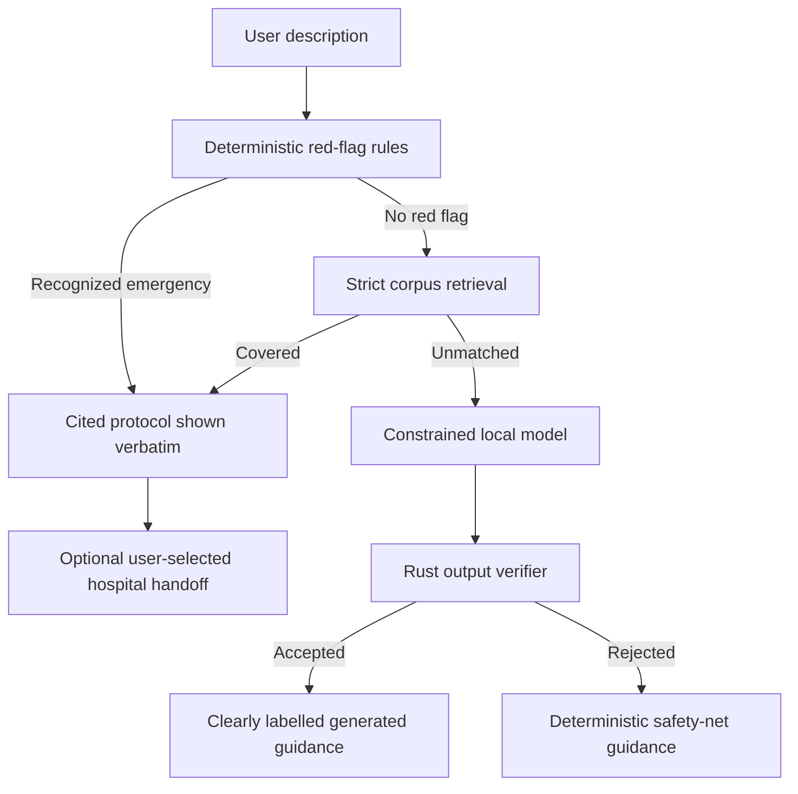

# Prohori

**Offline-first emergency guidance, private on-device AI, and parallel hospital coordination for Android.**

[](https://github.com/Hasan3301-cyber/Prohori/actions/workflows/ci-public.yml)


> [!WARNING]
> Prohori is an emergency-support prototype. It is not a doctor, diagnostic system, medical
> device, or replacement for emergency services and qualified clinicians. The bundled
> first-aid cards cite public sources but currently record no clinician reviewer. The bundled
> Rajshahi city pack is a visibly labelled, non-field-checked demonstration.

## Contents

- [Why Prohori exists](#why-prohori-exists)
- [What the application provides](#what-the-application-provides)
- [Safety model](#safety-model)
- [How the three modes work](#how-the-three-modes-work)
- [Hospital selection and confirmation](#hospital-selection-and-confirmation)
- [Install and use](#install-and-use)
- [Configuration](#configuration)
- [Architecture and technology](#architecture-and-technology)
- [Data, privacy, and security](#data-privacy-and-security)
- [Build from source](#build-from-source)
- [Testing and release validation](#testing-and-release-validation)
- [Current limitations](#current-limitations)

## Why Prohori exists

During an emergency, a person may need to act while the internet is slow, roads are disrupted,
and nearby hospitals are not answering. Several failures can happen together:

- cloud-only AI becomes unavailable;
- a person does not know the safest immediate first-aid action;
- the geographically nearest hospital may not be the fastest by road;
- the nearest hospital may not be ready for the required service;
- contacting hospitals one at a time wastes time;
- silence can be mistaken for acceptance;
- sensitive symptom text can be exposed to unnecessary online services.

Prohori combines local safety rules, cited offline guidance, a bundled local language model,
nearby-facility discovery, six-way route comparison, and explicit hospital confirmation. The
language model is never trusted to choose the hospital, lower urgency, or replace verified
guidance.

## What the application provides

| Capability | Implementation |
|---|---|
| Android application | Kotlin and Jetpack Compose UI with a Rust safety/routing core |
| Offline emergency detection | Deterministic Rust red-flag rules run on every description |
| Offline first aid | 18 embedded, cited, versioned protocols plus a safety-net card |
| Private local AI | Bundled Qwen3 1.7B Q4 GGUF executed by llama.cpp on the phone |
| Unknown-symptom fallback | Constrained local generation when no rule or protocol covers the report |
| Emergency-aware chat | Red flags bypass free-form chat and show deterministic guidance verbatim |
| Care-service suggestion | Coarse routing categories such as cardiac, trauma, burns, or respiratory emergency |
| Nearby hospitals | LocationIQ Nearby from an explicitly requested foreground location |
| Parallel route comparison | One Matrix request evaluates distance and ETA for up to six facilities |
| Parallel alerts | Up to six registered hospital contacts are notified concurrently |
| Readiness confirmation | Only an explicit `YES` for the matching case confirms a hospital |
| Best-hospital selection | Lowest provider ETA among explicitly confirmed facilities |
| Offline routing | Signed city packs, local GPS origin, freshness checks, and fail-closed road rules |
| Offline contact fallback | Cached facility route plus user-controlled dialer and SMS composer actions |
| Secure settings | Android Keystore-backed encryption for API keys, tokens, and facility contacts |
| Accessibility | English/Bangla resources, optional speech input, read-aloud, large emergency actions |

## Safety model

Prohori deliberately separates deterministic decisions from generated text.



The following boundaries are enforced:

- deterministic urgency cannot be reduced by the model;
- a verified first-aid card cannot be replaced by generated prose;
- emergency chat bypasses free-form model generation;
- generated emergency fallback cannot contain medicine names, dosages, invented numbers, or
  invasive procedures;
- hospital alerts contain a broad service category, ETA, facility, and case ID—not patient
  names, coordinates, or symptom text;
- no reply is never treated as hospital readiness;
- the AI does not diagnose, prescribe, or claim to behave as a real doctor;
- calls, SMS messages, navigation, and hospital notifications require visible user actions.

The bundled model is the base Qwen3 model. A research QLoRA pipeline is included for
reproducibility, but no medically fine-tuned adapter is shipped or claimed.

## How the three modes work

### 1. Offline emergency

Offline guidance works with no internet, API key, or cloud account.

1. The user types or speaks what is happening.
2. Rust red-flag rules run immediately.
3. A matched protocol is rendered with steps, “do not” warnings, escalation conditions,
   citations, and review status.
4. Strict retrieval can show other relevant cards without changing urgency.
5. Only a genuinely unmatched description may reach the local model.
6. Rust validates generated output before anything appears.
7. The emergency-number action opens Android's dialer; Prohori does not place a hidden call.

The **Hospital routing and dispatch** section can use the phone's foreground GPS/network
location with an installed signed city pack. No map server is contacted. If location is
unavailable, the user may explicitly select **Use RUET demo origin**; that coordinate is never
used silently.

### 2. Online emergency

Online mode coordinates real nearby-place discovery and hospital contact:

1. The user taps **Find nearby hospitals** and grants foreground location permission.
2. LocationIQ Nearby returns medical facilities around the phone.
3. Prohori removes pharmacies, laboratories, veterinary facilities, invalid coordinates,
   unnamed entries, and duplicates.
4. Up to six facilities are shortlisted.
5. LocationIQ Matrix compares all six road distances and ETAs in one request. If Matrix is
   unavailable, quota-paced Directions requests are used without silently dropping a facility.
6. The user registers a verified Telegram chat, hotline, and/or SMS destination per facility.
7. Registered Telegram alerts are sent concurrently through an HTTPS relay or a personal
   single-device bot.
8. Replies are polled and parsed strictly as `YES` or `NO` for a case ID.
9. Among hospitals that explicitly replied `YES`, the lowest provider ETA wins.
10. Detailed turn-by-turn directions are fetched only for the selected confirmed hospital.

Route duration is not labelled as live traffic unless the provider response explicitly reports
a traffic data source. Prohori does not invent flood, blockage, road-quality, or hospital-capacity
information.

### 3. Private AI chat

Chat mode runs locally with bounded recent history and streamed output. It supports cancel,
retry, and preserves the conversation during a failed request.

Before every generation, deterministic triage checks recent user context. If the conversation
contains a recognized emergency:

- the free-form model is bypassed;
- the cited emergency card is shown verbatim;
- Prohori suggests a broad care service, such as emergency medicine with cardiac support;
- the UI clearly states that this is routing metadata, not a diagnosis;
- **Open first aid** and **Find hospitals** provide explicit handoff actions.

For ordinary questions the small local model gives general suggestions. It is less capable and
slower than a cloud model, so its output should not be used for diagnosis or urgent decisions.

## Hospital selection and confirmation

Hospital selection is deterministic and auditable:

```text
nearby facilities
    → route ETA for up to 6
    → concurrent alerts to registered contacts
    → explicit YES/NO only
    → confirmed facilities only
    → lowest ETA wins
    → detailed route for the winner
```

Important rules:

- an unregistered facility stays visible but is marked unregistered;
- delivery means only that the alert was delivered;
- `ready`, `maybe`, silence, and an unrelated reply do not confirm readiness;
- every alert carries a case ID;
- a failed or declined facility can be retried individually;
- external navigation remains user-controlled;
- hotline and SMS actions open Android's dialer/composer and leave the final action to the user.

## Install and use

### Requirements

- Android 7.0 or newer (`minSdk 24`)
- ARM64 or ARMv7 phone
- 4 GB RAM or more recommended for local AI
- approximately 1.2 GB for the APK
- at least 2.5–3 GB free during installation and first launch

The latest published GitHub release is currently the earlier `v0.7.0-dev` evaluation build:

**[Download the published evaluation APK](https://github.com/Hasan3301-cyber/Prohori/releases/download/v0.7.0-dev/prohori-v0.7.0-dev-debug.apk)**

The source tree is `1.0.0-rc1` and contains newer functionality than that published artifact.
Build the current source to evaluate the features described here. Do not attempt to install
`app-release-unsigned.apk`; Android correctly rejects an unsigned release package.

For a locally built evaluation APK:

```powershell
adb install -r -d app/build/outputs/apk/debug/app-debug.apk
```

On first launch, Prohori copies and verifies the bundled model into private app storage. Keep the
app open while **Preparing local AI** is displayed. A valid installed model is preserved during
upgrades.

### Complete user guide

#### First launch

1. Open Prohori after installation.
2. Read the safety notice and continue through onboarding.
3. Keep the application open while **Preparing local AI** is displayed. The progress screen
   shows how many model bytes have been copied and, once enough progress is available, an
   estimated remaining time.
4. If preparation fails because storage is low, free space and press **Try again**. You may
   choose **Continue without local AI**; deterministic emergency rules and first-aid cards will
   still work.
5. When preparation finishes, use the bottom navigation to choose **Offline**, **Online**, or
   **AI** chat mode.

> [!IMPORTANT]
> In an obvious emergency, call local emergency services immediately. Do not wait for model
> preparation, an AI response, route discovery, or a hospital message.

#### Offline emergency guidance

Use this mode when the internet is unavailable or immediate first-aid guidance is needed.

1. Select **Offline** in the bottom navigation.
2. In **What is happening?**, describe observable facts in a short sentence. Examples:
   - `He is not breathing.`
   - `My father has chest pain and is sweating.`
   - `She burned her arm with hot water.`
3. Tap **Check symptoms offline**. Critical red flags are also evaluated while the description
   is being entered.
4. If an emergency is recognized, read the displayed card from the beginning. Confirm that its
   **Applies to** description fits the situation.
5. Follow the numbered steps and read the **Do not** and **Get help if** sections. Prohori shows
   the card's sources and whether a clinician has reviewed it.
6. Use **Read aloud** only when spoken guidance would help. It never starts automatically and
   can be stopped at any time.
7. Use the fixed emergency button to open Android's dialer. Confirm the number before placing
   the call.
8. If no protocol covers the description, the private model may prepare a separate block of
   constrained guidance. It is clearly labelled as model-written text. Press **Cancel local
   AI** to stop generation or **Try again** after a failure.
9. Edit the description whenever the situation changes. Guidance generated for older text is
   not reused under the new description.

#### Offline hospital route and contact fallback

This feature requires an installed signed city pack. The bundled RUET/Rajshahi pack is only a
technical demonstration and is marked **not field checked**.

1. From Offline mode, expand **Hospital routing and dispatch**.
2. Tap **Route from this phone**.
3. Grant foreground location permission and ensure Android Location is enabled. Prohori reads
   GPS/network location locally; it does not contact LocationIQ for this route.
4. Review the route result, data age, condition sources, and every considered hospital. A route
   can be refused when data is stale, incomplete, blocked, or incompatible with the configured
   vehicle.
5. If device location is unavailable and you only want to inspect the demonstration, tap
   **Use RUET demo origin**. Prohori never selects this coordinate automatically.
6. A cached online hospital may expose **Call hospital** or **Prepare SMS** when verified contact
   details were saved earlier. Android leaves the final call or Send action to you.
7. Treat all cached ETAs, road conditions, and readiness information as historical. Their age
   is displayed and they are not proof that a hospital is currently ready.

#### Configure Online mode

Online discovery requires a LocationIQ API key. Hospital notification additionally requires an
HTTPS relay or a personal Telegram bot used by only this phone.

1. Tap the settings icon in the application header.
2. Enter the **LocationIQ API key** supplied by your LocationIQ account.
3. For a managed deployment, enter the organization-provided **Relay HTTPS URL** and **Relay
   device token**.
4. For supervised single-phone testing only, a personal **Telegram bot token** may be entered
   instead of relay credentials.
5. Review the emergency-number country and override. Correct it if the inferred number does not
   match the user's actual location.
6. Press **Save**. Credentials are encrypted on this device and are not written into the APK.

#### Find and compare nearby hospitals

1. Select **Online**.
2. Tap **Find nearby hospitals**.
3. Grant foreground location permission. The request is made only after this tap.
4. Wait while Prohori finds medical facilities and calculates candidate routes.
5. Review up to six hospital cards. Each card shows the facility, provider route distance,
   estimated time, fetch time, route age, and whether a traffic datasource was explicitly
   reported.
6. Do not interpret **Traffic not verified** as a traffic-free road. It means Prohori has no
   provider evidence for a live traffic claim.
7. Tap **Open route** to inspect a facility in an installed navigation application. Opening a
   route does not contact or confirm that hospital.

#### Register hospital contact options

Hospital contacts should be entered only after they have been verified with the facility.

1. On a hospital card, enter its Telegram numeric chat ID or verified `@username`.
2. Optionally enter a verified hotline and SMS destination.
3. Tap **Save contacts**.
4. Hospital staff must have already started the bot or added it to their group; Telegram bots
   cannot initiate a conversation with an unknown group.
5. Use **Call** or **Prepare SMS** for a user-controlled fallback. These actions do not silently
   call or send anything.

#### Notify hospitals in parallel

1. After routes are ready and contacts are registered, tap **Notify all registered hospitals in
   parallel**.
2. Prohori sends to as many as six registered Telegram destinations concurrently. Unregistered
   facilities remain visible and are marked as not contacted.
3. Watch the workflow timeline and each hospital's state:
   - **Delivered; awaiting reply** means the request reached the transport, not that the hospital
     accepted the patient.
   - **Explicit YES** means a matching human reply confirmed readiness.
   - **Explicit NO** means the hospital declined.
   - **Delivery failed** means the request did not reach the destination.
4. If needed, use **Retry this hospital** on a failed or declined card.
5. Never treat silence, `maybe`, or a generic `ready` message as acceptance. Prohori does not.
6. When one or more hospitals explicitly reply `YES`, Prohori selects the confirmed facility
   with the lowest provider ETA and fetches its detailed route.
7. Review the selected hospital and tap **Open route**. Continue following emergency-dispatcher
   or medical-professional instructions over application suggestions.

#### Private AI chat

Use Chat for general, non-urgent suggestions that do not require hospital discovery.

1. Select **AI** in the bottom navigation.
2. Type a question or tap the voice-input action.
3. Tap **Send**. The answer appears progressively as it is generated on the phone.
4. Ask follow-up questions normally; Prohori keeps a bounded recent conversation context.
5. Tap **Cancel local AI** if generation is taking too long. The conversation remains available,
   and **Try again** can resend an unanswered question.
6. If recent messages contain a recognized emergency, Prohori bypasses free-form AI, displays
   deterministic first-aid guidance, and suggests a broad emergency service. The suggestion is
   routing metadata—not a diagnosis.
7. Tap **Open first aid** to move to Offline emergency guidance or **Find hospitals** to move to
   Online discovery. No hospital is contacted until the corresponding user action is taken.

#### Permissions and privacy behavior

| Permission/action | When it is used |
|---|---|
| Internet | LocationIQ discovery/routing and Telegram or relay communication |
| Foreground location | Only after a route/discovery action initiated by the user |
| Speech recognition | Only after the user taps voice input; handled by an Android speech service |
| Dialer | Opens with a number filled in; the user places the call |
| SMS composer | Opens with a readiness message filled in; the user presses Send |

Prohori does not request background location, direct-call, SMS-reading, SMS-sending, or phone-state
permissions. Medical descriptions and chat history are not saved by the application.

#### Common problems

- **“App not installed”** — make sure the APK is signed, enough storage is available, and an
  incompatible build with a different signature is not already installed. Never install the
  unsigned release APK.
- **Local AI appears slow** — the bundled model is large and speed depends on the phone. Keep the
  app foregrounded, close memory-heavy apps, and use Cancel if necessary.
- **No current location** — enable Android Location, grant foreground permission, and retry.
- **LocationIQ rejected the request** — verify the API key, internet connection, and account
  quota in Settings.
- **Hospital is unregistered** — add and save the exact facility's verified Telegram contact.
- **Telegram alert receives no reply** — call the hospital. Silence is not confirmation.
- **No dialer or SMS app opened** — use the displayed number/script manually or another phone.

## Configuration

All runtime credentials are entered by the user and encrypted locally.

| Setting | Purpose |
|---|---|
| LocationIQ API key | Nearby discovery, Matrix comparison, and detailed Directions |
| Relay HTTPS URL | Organization-hosted hospital notification relay |
| Relay device token | Authenticates this installation to the relay |
| Personal Telegram bot token | Single-phone development or supervised testing |
| Facility Telegram chat | Destination for the readiness request |
| Facility hotline | User-controlled dialer action |
| Facility SMS number | User-controlled readiness-message composer |
| Emergency number override | Corrects the locally inferred emergency number |

A Telegram bot cannot initiate a conversation with a group that has never added or started it.
Enroll each participating hospital, bind the exact facility ID to its verified contact, and run a
supervised test before any field use. Multiple phones should use one organization relay; sharing
one bot's `getUpdates` stream across phones can route replies incorrectly.

## Architecture and technology

| Layer | Technology | Responsibility |
|---|---|---|
| Android UI | Kotlin, Jetpack Compose, Material 3 | Modes, guidance, settings, routing, confirmation |
| Safety core | Rust | Red flags, retrieval, verification, city packs, route refusal, confirmation state |
| Android/Rust bridge | UniFFI and JNA | Typed boundary to the compiled Rust library |
| Local inference | llama.cpp through JNI/CMake | GGUF load, streaming generation, cancellation |
| Bundled model | Qwen3 1.7B Q4_K_M | General chat and tightly constrained unmatched fallback |
| Online places/routes | LocationIQ Nearby, Matrix, Directions | Real facilities, ETA comparison, winner directions |
| Messaging | Telegram Bot API or HTTPS relay | Parallel alerts and case-bound explicit replies |
| Secret storage | Android Keystore and AES-GCM | API keys, relay credentials, bot token, contacts |
| Offline routing | Ed25519/SHA-256 signed city packs | Hospitals, roads, conditions, emergency numbers |
| Build | Gradle, Cargo, cargo-ndk, CMake | Android, Rust, UniFFI, and llama.cpp integration |

```text
Prohori/
├── app/                  Android application, Compose UI, JNI bridge, device tests
├── core/                 Deterministic Rust safety, data, confirmation, and routing
├── core-ffi/             UniFFI records and Android-facing Rust API
├── data/
│   ├── firstaid/         Cited first-aid protocol JSON
│   ├── grammar/          Constrained decoding grammars
│   ├── guidance/         Unknown-emergency deterministic safety net
│   └── prompts/          Local model contracts
├── model/
│   ├── model.lock.json   Model/runtime provenance and hashes
│   └── README.md         Optional research training pipeline and its limitations
├── tools/                Reproducible preparation, probes, benchmarks, and validation
├── .github/workflows/    Public CI and protected production gates
├── Cargo.toml
└── settings.gradle.kts
```

Model weights, APKs, signing keys, generated datasets, build directories, internal plans, and
local evidence are intentionally excluded from Git.

## Data, privacy, and security

- emergency and chat inference runs locally;
- medical descriptions and chat history are not persisted by the app;
- credentials and facility contacts are encrypted with an Android Keystore-backed key;
- release builds refuse debug bot tokens;
- relay URLs require HTTPS except explicit debug-loopback addresses;
- hospital readiness alerts omit patient names, symptoms, and coordinates;
- LocationIQ and relay responses are size-bounded and structurally validated;
- signed city packs reject unknown files, duplicates, missing files, stale conditions,
  oversized content, bad hashes, invalid signatures, and path traversal;
- invalid contacts fail closed;
- backup rules exclude sensitive app data;
- production validation scans the APK for configured secret values.

## Build from source

### Prerequisites

- JDK 17
- Android SDK platform 36
- Android NDK `27.3.13750724`
- CMake `3.31.6`
- Rust `1.90` or newer
- `cargo-ndk 4.1.2`
- PowerShell for the model preparation scripts
- about 8 GB free for downloads and build intermediates

Prepare the pinned model and native runtime:

```powershell
cargo install cargo-ndk --version 4.1.2 --locked
powershell -ExecutionPolicy Bypass -File tools/prepare-model.ps1
```

Expected bundled Q4 artifact:

```text
model/artifacts/Qwen3-1.7B-Q4_K_M.gguf
bytes:  1107408544
sha256: 54c0f1203a724e9f33e76916beab3bdfaffef56cf7b42a93b1bc21319fc0bf97
```

Build an evaluation APK:

```powershell
$env:JAVA_HOME = "C:\Program Files\Android\Android Studio\jbr"
$env:ANDROID_HOME = "$env:LOCALAPPDATA\Android\Sdk"
$env:ANDROID_NDK_HOME = "$env:ANDROID_HOME\ndk\27.3.13750724"
./gradlew.bat :app:assembleDebug '-PprohoriAbis=arm64-v8a,armeabi-v7a'
```

Output: `app/build/outputs/apk/debug/app-debug.apk`

### Production signing

Release signing is explicit and fail-closed. Copy `signing.properties.example` to the ignored
`signing.properties`, point it at the organization-controlled keystore, and build:

```powershell
./gradlew.bat :app:assembleRelease -PprohoriProductionSigning=true `
  '-PprohoriAbis=arm64-v8a,armeabi-v7a'
```

Never commit the keystore or its credentials. A normal `assembleRelease` produces an unsigned
artifact for inspection, not installation.

## Testing and release validation

Run the Rust safety and quality gates:

```powershell
cargo fmt --all -- --check
cargo clippy --workspace --all-targets --locked -- -D warnings
cargo test --workspace --locked
```

Run Android unit tests, lint, builds, and instrumentation packaging:

```powershell
./gradlew.bat :app:testDebugUnitTest :app:lintDebug `
  :app:assembleDebug :app:assembleRelease :app:assembleDebugAndroidTest
```

Validate a signed evaluation artifact:

```powershell
./tools/validate-release.ps1 `
  -ApkPath app/build/outputs/apk/debug/app-debug.apk `
  -Mode Evaluation `
  -RepositoryRoot .
```

The validator checks signature policy, package ID, 16 KiB ZIP alignment, both native ABIs, the
uncompressed model's exact hash/size, and configured-secret leakage. The protected
`production-gates` workflow can create a production-signed artifact only when repository signing
secrets are supplied.

Current automated coverage includes:

- corpus integrity, citation/review metadata, and readability;
- red flags, misspellings, second-language normalization, retrieval, and negative cases;
- constrained fallback output and medication/dosage/invasive-action rejection;
- signed city-pack import, tamper/staleness refusal, road constraints, and route selection;
- LocationIQ parsing, six-destination comparison, and route freshness;
- parallel six-hospital fan-out, strict replies, retry, and fastest-confirmed selection;
- coarse emergency-service propagation without patient text;
- encrypted storage, backup exclusions, model integrity, cancellation, and conversation history;
- visible offline submission controls and physical-device local-model benchmarks.

## Current limitations

- The GitHub release APK is older than the current `1.0.0-rc1` source.
- A real production APK still requires the owner's protected signing key.
- The APK is large because it includes a 1.1 GB local model; first launch needs space for both
  the APK and extracted model.
- The model is a general base model, not medically fine-tuned or clinically certified.
- All 18 bundled protocols currently have citations but no recorded clinician approval.
- The bundled Rajshahi pack contains one demonstration hospital and is marked
  `field_checked: false`; it is not a complete city database.
- There is no central Prohori hospital database or automatic hospital-enrollment backend.
- LocationIQ route duration/distance does not independently prove live traffic, flood status,
  road quality, or ambulance access.
- Hospital readiness works only after real facilities are enrolled and their contacts verified.
- Hotline and SMS destinations can become stale; opening a dialer/composer is not confirmation.
- Local AI latency depends on RAM, CPU, thermal state, and other applications on the phone.
- Prohori has not completed clinician review, medical-device approval, accessibility audit, or
  controlled field deployment.

## Attribution

- [Qwen3-1.7B-GGUF](https://huggingface.co/Qwen/Qwen3-1.7B-GGUF) under its published license
- [llama.cpp](https://github.com/ggml-org/llama.cpp)
- [LocationIQ](https://locationiq.com/) and OpenStreetMap-derived data
- protocol-specific sources recorded in `data/firstaid/*.json`

## Maintainer

[Hasan3301-cyber](https://github.com/Hasan3301-cyber)
